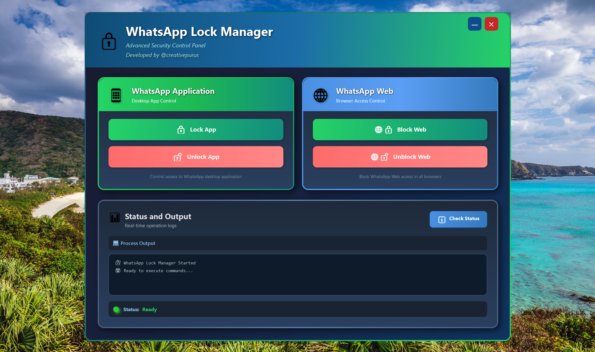
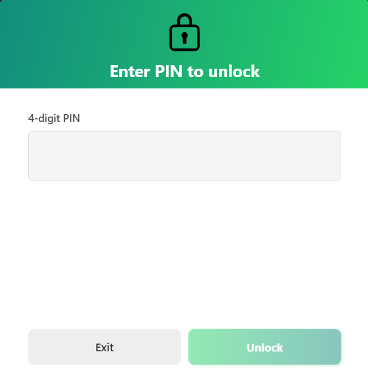

# 🔒 WhatsApp Lock Manager

> A powerful Windows desktop application to control access to WhatsApp Desktop and Web with PIN protection

[](https://opensource.org/licenses/MIT)
[](https://www.microsoft.com/windows)
[](https://dotnet.microsoft.com/)
[](https://github.com/creativepurus/WhatsAppLockManager/releases/latest)

WhatsApp Lock Manager is a sophisticated Windows application that provides PIN-protected access control for both WhatsApp Desktop and WhatsApp Web. Built with modern .NET technology and featuring a clean WPF interface, it uses system-level privileges to ensure robust protection that persists across reboots.

## 📸 App Screenshots

<div align="center">
  
  <br/><br/>
  
  <br/><br/>
  
</div>

## ✨ Features

- 🔐 **Lock WhatsApp Desktop** - Prevent access to WhatsApp Desktop application via file system permissions
- 🧪 **WhatsApp Beta Support** - Detect and lock the Microsoft Store Beta variant reliably
- 🎛️ **Advanced Selection** - Choose to lock Standard WhatsApp, WhatsApp Beta, or system-wide WhatsApp Web
- ⚡ **Improved Detection & Stability** - Faster, more accurate identification of active WhatsApp instances
- 🌐 **Lock WhatsApp Web** - Block web.whatsapp.com domains through hosts file modification
- 🔑 **PIN Protection** - Secure 4-digit PIN system to prevent unauthorized unlocking
- 👨‍💼 **System-Level Control** - Uses Windows SYSTEM privileges for robust protection
- 🎨 **Modern UI** - Clean and intuitive WPF interface
- 📝 **Activity Logging** - Track all lock/unlock operations with timestamps


## 💻 Installation Steps

### Quick Installation

1. **Download the Latest Release**
   - Visit the [Releases page](https://github.com/creativepurus/WhatsAppLockManager/releases/latest)
   - Download `WhatsAppLockManager_Setup_2.5.0.exe` from the **Assets** section
   - Or Download the portable `WhatsAppLockManager_Setup_2.5.0.zip` from **Releases → Assets**

2. **Run the Installer**
   - Right-click the downloaded file and select "Run as Administrator"
   - If Windows SmartScreen appears, click "More info" → "Run anyway"

3. **Follow the Setup Wizard**
   - Accept the license agreement
   - Choose installation directory (default: `C:\Program Files\WhatsAppLockManager`)
   - Select Start Menu folder
   - Choose Desktop shortcut option (recommended)

4. **Read Documentation**
   - User Guide and Privacy Statement will open automatically after installation
   - Review important security and usage information

5. **Launch the Application**
   - Use the Desktop shortcut or Start Menu entry
   - **Important:** Always run as Administrator for proper functionality

### 🔐 File Integrity Verification

Before installing, verify the downloaded file's authenticity:

**SHA-256 Hash:**
```
bd41e2ff10503088bedc5f4db4f748fb77db3795543cd9db7df54033190a9aef
```

**To verify integrity:**

Open Command Prompt in the download folder and run:
```cmd
certutil -hashfile WhatsAppLockManager_Setup_2.5.0.exe SHA256
```

Compare the output with the hash above. They should match exactly.

### 🧪 VirusTotal Scan

✅ This file has been scanned and verified safe on VirusTotal:

🔗 **[View VirusTotal Scan Report](https://www.virustotal.com/gui/file/bd41e2ff10503088bedc5f4db4f748fb77db3795543cd9db7df54033190a9aef/detection)**

> **Note:** Some antivirus software may flag PsExec.exe (a legitimate Microsoft Sysinternals tool included in the package). This is a known false positive.

---

---

## 🪟 How to Use

### First Time Setup

1. **Set Your PIN**
   - Launch the application (requires Administrator privileges)
   - Enter a 4-digit PIN when prompted
   - Confirm your PIN
   - **Important:** Remember your PIN - recovery requires manual file editing

2. **Understanding the Interface**
   - **Lock App Button:** Controls WhatsApp Desktop access
   - **Lock Web Button:** Controls WhatsApp Web access
   - **Status Indicators:** Green = Unlocked, Red = Locked
   - **Activity Log:** Shows all lock/unlock operations with timestamps

### Locking WhatsApp Desktop

> 🟢 Tip: For the most accurate detection, make sure **WhatsApp Desktop is already running** before you initiate a lock. This helps the app locate the active process and apply the correct lock parameters.

1. Ensure **WhatsApp Desktop is Running**
2. Click "Lock App" button
3. Enter your PIN when prompted
4. The application will:
   - Detect WhatsApp installation location
   - Close any running WhatsApp processes
   - Apply system-level file permissions to prevent access
   - Confirm lock status (button turns red)

### Locking WhatsApp Web

1. Click "Lock Web" button
2. Enter your PIN when prompted
3. The application will:
   - Modify Windows hosts file to block WhatsApp Web domains
   - Close any open browser tabs accessing WhatsApp Web
   - Confirm lock status (button turns red)

### Unlocking

1. Click "Unlock App" or "Unlock Web" button
2. Enter your 4-digit PIN
3. Access will be restored immediately
4. Status indicator returns to green

### Tips for Best Results

- Always run the application as Administrator
- Close WhatsApp Desktop before locking for clean operation
- Test lock/unlock functionality after installation
- Keep the application pinned to taskbar for quick access
- Review activity logs to monitor all operations

### Advanced Lock Options

- Left Side: type `1` → Lock Standard WhatsApp (Microsoft Store version)
- Left Side: type `2` → Lock Special WhatsApp Beta version
- Right Side: lock any version of WhatsApp Web across the entire PC/laptop

---

## 📖 How It Works

### Lock WhatsApp Desktop App

- Modifies Windows file permissions (ACLs) on WhatsApp installation folder
- Denies current user access while keeping system access intact
- Automatically detects WhatsApp installation location
- Closes running WhatsApp processes before locking
- Identifies whether Standard or Beta WhatsApp is active and applies a targeted lock accordingly

### Lock WhatsApp Web

- Adds blocking entries to Windows hosts file (`C:\Windows\System32\drivers\etc\hosts`)
- Redirects WhatsApp Web domains to `127.0.0.1` (localhost)
- Closes browser tabs accessing WhatsApp Web domains
- Supports Chrome, Edge, Firefox, and other browsers
- Can be enforced system-wide to restrict WhatsApp Web across all browsers

---

---

## ⚙️ System Requirements

### Minimum Requirements

- **Operating System:** Windows 10 version 1809 or later (64-bit)
- **Processor:** x64 compatible CPU
- **RAM:** 2 GB minimum
- **Disk Space:** ~150 MB for installation
- **Privileges:** Administrator account required
- **Optional:** WhatsApp Desktop installed (for app locking feature)

### Supported Operating Systems

- ✅ Windows 10 (64-bit) - Version 1809 or newer
- ✅ Windows 11 (64-bit) - All versions
- ❌ Windows 8.1 and earlier (not supported)
- ❌ 32-bit Windows (not supported)

### Additional Requirements

- Administrator rights for installation and operation
- .NET 8.0 runtime (included in installer, no separate installation needed)
- UAC (User Account Control) should be enabled
- Write access to `C:\Windows\System32\drivers\etc\hosts` (for web blocking)

---

## 🧠 Technical Stack

### Core Technologies

- **Programming Language:** C# 10
- **Framework:** .NET 8.0
- **UI Framework:** Windows Presentation Foundation (WPF)
- **Development Environment:** Visual Studio Code / Visual Studio 2022
- **Target Platform:** Windows x64

### Deployment & Packaging

- **Installer Creator:** Inno Setup 6.x
- **Deployment Type:** Self-contained with runtime bundled
- **Package Size:** ~52 MB (includes .NET 8 runtime)
- **Installed Size:** ~150 MB

### System Integration

- **Privilege Elevation:** PsExec (Microsoft Sysinternals PSTools)
- **File Permissions:** Windows ACL (Access Control Lists) modification
- **Process Management:** Windows Process API
- **Configuration Storage:** JSON-based local configuration

### Security Features

- **PIN Encryption:** Encrypted storage using local cryptography
- **File Protection:** System-level permissions on security components
- **Privilege Model:** SYSTEM-level execution for robust protection
- **Audit Trail:** Timestamped activity logging

---

## 🧾 Changelog

### v2.5.0 (2025-10-24) - Initial Public Release

#### 🎉 New Features
- ✨ **PIN Protection System**: Secure 4-digit PIN authentication for all lock/unlock operations
- 🔐 **WhatsApp Desktop Locking**: System-level file permission control with ACL modification
- 🌐 **WhatsApp Web Blocking**: Hosts file-based domain blocking for WhatsApp Web
- 🎨 **Modern WPF Interface**: Clean, intuitive UI with real-time status indicators
- 📝 **Activity Logging**: Comprehensive logging of all operations with timestamps
- 🔒 **SYSTEM Privilege Elevation**: Robust protection using PsExec from Sysinternals

#### 🛠️ Technical Improvements
- Self-contained deployment with .NET 8 runtime bundled
- Automatic WhatsApp Desktop installation detection
- Process management for clean lock operations
- Hidden security components with restricted permissions
- Encrypted PIN storage using local cryptography

#### 📦 Deployment
- Full Inno Setup installer with UAC elevation
- Integrated user documentation (User Guide, Privacy Statement, Visual Guide)
- Desktop and Start Menu shortcuts
- ~52 MB installer size with complete runtime

#### 🔒 Security
- All operations performed locally with no telemetry
- No network communication or data collection
- Open source security approach
- Safe ACL backup and restore mechanisms

---

## 🛡️ Privacy & Security

- **No telemetry** - All operations are local, no data sent online
- **No account required** - Works completely offline
- **Open installation** - No hidden processes or background services
- **Transparent operation** - All actions logged and visible to user
- **Local data only** - PIN and settings stored locally on your device
- **No cloud services** - Complete privacy with offline functionality

---

## ⚠️ Important Notes

- This tool requires **administrator privileges** to function
- Do not forget your PIN - recovery requires manual file editing
- Locked state persists across reboots
- Some antivirus software may flag PSTools executables (false positive)

---

## 🐛 Troubleshooting

**App won't lock WhatsApp Desktop:**
- Ensure WhatsApp Desktop is installed in default location
- Close WhatsApp completely before locking
- Run app as Administrator

**Web lock not working:**
- Check if browser has cached entries (clear browser cache)
- Some browsers may require restart after locking
- Verify hosts file permissions haven't been modified

**Forgot PIN:**
- Edit `%LOCALAPPDATA%\WhatsAppLockManager\config.json`
- Remove or change the `PIN` value (requires administrator access)

---

## 📞 Support & Contact

If you encounter any issues or have questions:

1. **Check Documentation** - Review the User Guide included with installation
2. **GitHub Issues** - Report bugs or request features on [GitHub Issues](https://github.com/creativepurus/WhatsAppLockManager/issues)
3. **Contact Developer:**
   - 💻 GitHub: [@creativepurus](https://github.com/creativepurus)
   - 💼 LinkedIn: [@creativepurus](https://linkedin.com/in/creativepurus)
   - ⏱️ CodeTime: [#creativepurus](https://codetime.dev/en/user/17354)

---

## 📜 License

MIT License

Copyright (c) 2025 Anand Purushottam (creativepurus)

Permission is hereby granted, free of charge, to any person obtaining a copy
of this software and associated documentation files (the "Software"), to deal
in the Software without restriction, including without limitation the rights
to use, copy, modify, merge, publish, distribute, sublicense, and/or sell
copies of the Software, and to permit persons to whom the Software is
furnished to do so, subject to the following conditions:

The above copyright notice and this permission notice shall be included in all
copies or substantial portions of the Software.

THE SOFTWARE IS PROVIDED "AS IS", WITHOUT WARRANTY OF ANY KIND, EXPRESS OR
IMPLIED, INCLUDING BUT NOT LIMITED TO THE WARRANTIES OF MERCHANTABILITY,
FITNESS FOR A PARTICULAR PURPOSE AND NONINFRINGEMENT. IN NO EVENT SHALL THE
AUTHORS OR COPYRIGHT HOLDERS BE LIABLE FOR ANY CLAIM, DAMAGES OR OTHER
LIABILITY, WHETHER IN AN ACTION OF CONTRACT, TORT OR OTHERWISE, ARISING FROM,
OUT OF OR IN CONNECTION WITH THE SOFTWARE OR THE USE OR OTHER DEALINGS IN THE
SOFTWARE.

---

## 🙌 Author / Credits

### 👨‍💻 Developer

**Anand Purushottam** (creativepurus)

- 💻 GitHub: [@creativepurus](https://github.com/creativepurus)
- 💼 LinkedIn: [@creativepurus](https://linkedin.com/in/creativepurus)
- ⏱️ CodeTime: [#creativepurus](https://codetime.dev/en/user/17354)

### 🎓 Acknowledgments

This project wouldn't be possible without:

- **Microsoft Sysinternals** - For PSTools (PsExec) suite
- **.NET Team** - For the amazing WPF framework and .NET 8 runtime
- **Inno Setup** - For the powerful installer creation tool
- **PS2EXE** - For PowerShell script compilation capabilities
- **Open Source Community** - For inspiration and support

### 💖 Special Thanks

Thank you to all users who trust and use WhatsApp Lock Manager for their privacy needs!

---


<!-- Thanks for your Visit -->
<div align="center">
  <a href="https://git.io/typing-svg">
    
  </a>
    
</div>

<br>

<p align="center">
  <a href="https://linkedin.com/in/creativepurus/">
    
  </a>
</p>

<p align="center">
  <a href="https://github.com/sponsors/creativepurus/" title="Anand Purushottam's GitHub Sponsorship Profile">
    
  </a>
</p>


**Made with ❤️ by 💻 [@creativepurus](https://linkedin.com/in/creativepurus) 🇮🇳**

<!-- Back to TOP -->
<p align="right">
  <a href="#top">
    
  </a>
</p>

<!-- Footer -->
<p align="center">
  
</p>

---

