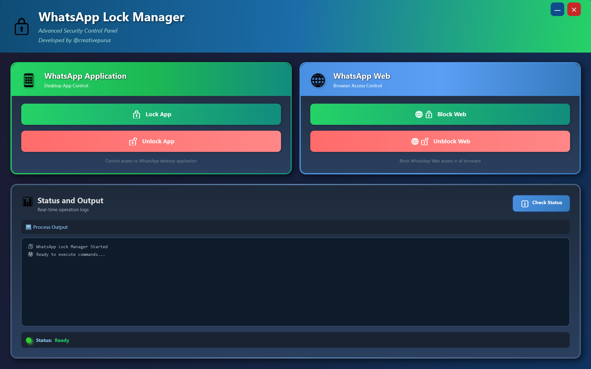

# 🔒 WhatsApp Lock Manager

A powerful Windows desktop application to control access to WhatsApp Desktop and Web with PIN protection.

## 📸 App Screenshots

  
  
  

## ✨ Features

- 🔐 **Lock WhatsApp Desktop** - Prevent access to WhatsApp Desktop application via file system permissions
- 🌐 **Lock WhatsApp Web** - Block web.whatsapp.com domains through hosts file modification
- 🔑 **PIN Protection** - Secure 6-digit PIN system to prevent unauthorized unlocking
- 👨‍💼 **System-Level Control** - Uses Windows SYSTEM privileges for robust protection
- 🎨 **Modern UI** - Clean and intuitive WPF interface
- 📝 **Activity Logging** - Track all lock/unlock operations with timestamps

## 📥 Download

**[Download Latest Installer (v2.5.0)](https://github.com/creativepurus/WhatsAppLockManager/releases/latest)**

- **File Size:** ~52 MB (includes .NET 8 runtime)
- **Requirements:** Windows 10/11 (64-bit)
- **Administrator privileges required**

## 🔥 Quick Start

1. Download and run `WhatsAppLockManager_Setup_2.5.0.exe`
2. Follow the installation wizard
3. **Read the User Guide** (opens automatically after install)
4. Launch the app and set your 6-digit PIN
5. Click "Lock App" or "Lock Web" to activate protection

## 📖 How It Works

### Lock WhatsApp Desktop App
- Modifies Windows file permissions (ACLs) on WhatsApp installation folder
- Denies current user access while keeping system access intact
- Automatically detects WhatsApp installation location
- Closes running WhatsApp processes before locking

### Lock WhatsApp Web
- Adds blocking entries to Windows hosts file (`C:\Windows\System32\drivers\etc\hosts`)
- Redirects WhatsApp Web domains to `127.0.0.1` (localhost)
- Closes browser tabs accessing WhatsApp Web domains
- Supports Chrome, Edge, Firefox, and other browsers

## 🔓 Unlocking

Enter your 6-digit PIN and click "Unlock App" or "Unlock Web" to restore access. The app uses SYSTEM-level privileges to ensure locks cannot be bypassed without the correct PIN.

## ⚙️ Technical Details

- **Framework:** .NET 8.0 (WPF)
- **Deployment:** Self-contained (no .NET installation needed)
- **Elevation:** Uses PsExec from Sysinternals PSTools for SYSTEM privileges
- **Security:** PIN encrypted and stored locally, hidden support files with restricted ACLs

## 🛡️ Privacy & Security

- **No telemetry** - All operations are local, no data sent online
- **No account required** - Works completely offline
- **Open installation** - No hidden processes or background services
- **Transparent operation** - All actions logged and visible to user

## 📋 System Requirements

- Windows 10 version 1809 or later (64-bit)
- Windows 11 (64-bit)
- Administrator account required
- ~150 MB disk space

## ⚠️ Important Notes

- This tool requires **administrator privileges** to function
- Do not forget your PIN - recovery requires manual file editing
- Locked state persists across reboots
- Some antivirus software may flag PSTools executables (false positive)

## 🐛 Troubleshooting

**App won't lock WhatsApp Desktop:**
- Ensure WhatsApp Desktop is installed in default location
- Close WhatsApp completely before locking
- Run app as Administrator

**Web lock not working:**
- Check if browser has cached entries (clear browser cache)
- Some browsers may require restart after locking
- Verify hosts file permissions haven't been modified

**Forgot PIN:**
- Edit `%LOCALAPPDATA%\WhatsAppLockManager\config.json`
- Remove or change the `PIN` value (requires administrator access)

## 📞 Support & Contact

- **Developer:** creativepurus
- 💻 GitHub: [@creativepurus](https://github.com/creativepurus)
- 💼 LinkedIn: [@creativepurus](https://linkedin.com/in/creativepurus)
- ⏱️ CodeTime : [#creativepurus](https://codetime.dev/en/user/17354)

## 📜 License

This software is provided as-is for personal use. See Privacy Statement included in installation for full terms.

## 🔄 Version History

### v2.5.0 (Current)
- Initial public release
- PIN-protected locking system
- Support for both Desktop app and Web blocking
- Modern WPF interface with real-time status updates
- Comprehensive logging and error handling
- Self-contained deployment with hidden security components

---

<!-- Thanks for your Visit -->

  
    

 

  

  

**Made with ❤️ by 💻 [@creativepurus](https://linkedin.com/in/creativepurus) 🇮🇳**

<!-- Back to TOP -->

  

<!-- Footer -->

  

